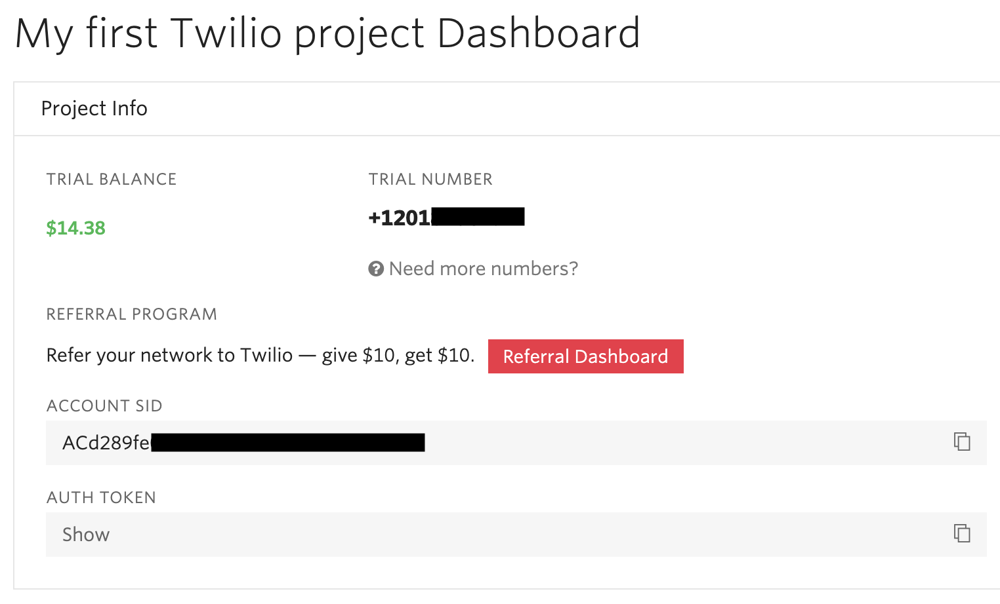

# Twilio phone call

## Description

This plug-in allows for forms to launch outbound calls via [Twilio](https://twilio.com/). 

## Warning: under active development

*This plug-in is still under active development and piloting, and there is no easy way (yet!) to decrypt encrypted audio recordings. If you're interested in piloting Twilio for CATI applications, please reach out to amrik@surveycto.com.*

## Features

 * Supports the `text` field type, saving call status, unique Twilio call SID, Twilio details API URL, and Twilio recordings API URL in a |-separated list (use [item-at()](https://docs.surveycto.com/02-designing-forms/01-core-concepts/09.expressions.html#Help_Forms_item-at) to access each item).
 * Supports displaying or hiding the number being dialed.
 * Supports audio recording within Twilio.

## How to use

To use the plug-in as-is, download the [twilio-call.fieldplugin.zip](https://github.com/surveycto/twilio-call/blob/master/twilio-call.fieldplugin.zip?raw=true) file from this repo, attach it to your form, and use it on one or more `text` fields. See below for a full list of required parameters.

You may want to try using it in a simple example form first:

 * Download the [twilio-call.fieldplugin.zip](https://github.com/surveycto/twilio-call/blob/master/twilio-call.fieldplugin.zip?raw=true) plug-in package.
 * Download the [twilio-call-example.xlsx](https://github.com/surveycto/twilio-call/blob/master/extras/sample-form/Twilio%20call%20sample%20form.xlsx?raw=true) example form.
 * Edit that example to change the two references to "+1" to be a plus followed by your current country code.
 * Download the [twilio_access.csv](https://github.com/surveycto/twilio-call/raw/master/extras/sample-form/twilio_access.csv) dataset template (right-click the link, click "Save link as", set format to "All Files", add `.csv` to the file name, and save).
 * Edit that .csv template to add your Twilio `Account SID` and `Auth Token`, as well as one of your Twilio numbers into the *1234* row.
 * Upload the example form to your SurveyCTO server, attaching both the plug-in package and the .csv file (alternatively, upload the .csv into a dataset and attach that dataset).
 
If you're new to Twilio, your free trial's home screen should include your trial Twilio number as well as your `Account SID` and `Auth Token`:

**Important:** please note that with a free Twilio trial account, you can only call to numbers that have been verified as belonging to you. So if you're using a trial account, be sure to [verify all numbers](https://www.twilio.com/docs/usage/tutorials/how-to-use-your-free-trial-account#verify-your-personal-phone-number) you want to test with before trying to call them. This includes the number you will call from. If you do not verify both the `fromNumber` and `toNumber`, you will get a status 400 error when trying to make a call.

When you use the plug-in, it will dial your number first (`fromNumber`), then dial the number you're trying to call (`toNumber`). If you're using a free trial account, there will be a brief message from Twilio before the second number is dialed.

The plug-in allows just one dial attempt per field, so the example form uses a repeat group to support multiple dial attempts. For each, the field itself records, in the field's response data, call status, unique Twilio call SID, Twilio details API URL, and Twilio recordings API URL in a |-separated list (use [item-at()](https://docs.surveycto.com/02-designing-forms/01-core-concepts/09.expressions.html#Help_Forms_item-at) to access each item). The full API response from Twilio is available in the field's metadata.

When a dial attempt is first made, the saved status will always be `queued`, which means that the dial attempt has been issued within Twilio. The user can click the `Update status` button to request updated status from Twilio, in which case the field's response value and metadata will be updated with the latest status.

## Required parameters

The plug-in requires that you specify values for each of the following parameters: 

| Key | Value |
| --- | --- |
| `fromNumber` | This is the phone number of the caller (generally the enumerator), starting with a country code (like *+1* for U.S. numbers). The dialer will dial this number first.|
| `toNumber` | This is the phone number to dial (generally the respondent), starting with a country code (like *+1* for U.S. numbers). The dialer will dial this number second, connecting it to the first.|
| `twilioNumber` | This is the Twilio number that will be used as the caller ID for both phone calls. Note that Twilio only allows one call per second from a given Twilio number, so if you have many enumerators making calls at the same time you may need to use multiple Twilio numbers.|
| `accountSID` | This is your Twilio Account SID.|
| `authToken` | This is your Twilio Auth Token.|
| `record` | This should be *1* to record the phone call within Twilio or *0* to not record the call. If the call is recorded, it will be recorded with Twilio's dual-channel support so that each side of the conversation can be isolated during analysis.|
| `displayNumber`| This should be *1* to show the `toNumber` in the form's user interface or *0* to hide the number.|

## More resources

* **Developer documentation**  
Instructions and resources for developing your own field plug-ins.  
[https://github.com/surveycto/Field-plug-in-resources](https://github.com/surveycto/Field-plug-in-resources)
* **User documentation**  
How to get started using field plug-ins in your SurveyCTO form.  
[https://docs.surveycto.com/02-designing-forms/03-advanced-topics/06.using-field-plug-ins.html](https://docs.surveycto.com/02-designing-forms/03-advanced-topics/06.using-field-plug-ins.html)
